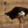
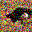
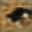

# CIFAR Autoencoder for Image Restoration 🧠🖼️

This project implements a convolutional autoencoder trained on the CIFAR-10 dataset. The autoencoder learns to reconstruct original images from damaged (noisy) inputs, making it useful for tasks like denoising or minor image restoration.

---

## 🔧 Features

- Trains an autoencoder using PyTorch on CIFAR-10 dataset
- Adds Gaussian noise to simulate image damage
- Learns to reconstruct the original image
- Visualizes original, noisy, and restored images
- Easily extendable to different noise types or datasets

---

## 🗂️ Project Structure

```

cifar\_autoencoder/
├── data/                   # CIFAR-10 data gets downloaded here
├── models/
│   └── autoencoder.py      # Autoencoder architecture
├── utils/
│   └── noise.py            # Noise-adding utility function
├── train.py                # Model training script
├── test.py                 # Testing & visualization
├── config.py               # Hyperparameters and constants
├── requirements.txt        # Python dependencies
└── README.md               # Project documentation

````

---

## 🚀 Getting Started

### 1. Clone the repository
```bash
git clone https://github.com/LukaBabunadze/cifar_autoencoder.git
cd cifar_autoencoder
````

### 2. Install dependencies

```bash
pip install -r requirements.txt
```

### 3. Train the model

```bash
python train.py
```

This script will:

* Download CIFAR-10
* Add Gaussian noise to images
* Train the autoencoder
* Save the trained model as `autoencoder.pth`

### 4. Test and visualize reconstruction

```bash
python test.py
```

You’ll see:

* The original image
* The noisy (damaged) version
* The restored (reconstructed) image

---

## 🧠 Model Architecture

A simple convolutional autoencoder:

* **Encoder:** 3 Conv layers (stride 2) to compress image
* **Decoder:** 3 ConvTranspose layers to reconstruct image

All activations use **ReLU** except for the final layer which uses **Sigmoid**.

---

## 🧪 Noise Function

The `utils/noise.py` file adds Gaussian noise:

```python
noisy = images + noise_factor * torch.randn_like(images)
```

You can tune `noise_factor` to make restoration harder or easier.

---

## 📈 Example Output

| Original                  | Noisy                  | Reconstructed                  |
| ------------------------- | ---------------------- | ------------------------------ |
|  |  |  |

---

## ⚙️ Configurable Parameters

Edit `config.py` to change:

```python
BATCH_SIZE = 128
EPOCHS = 20
LEARNING_RATE = 1e-3
DEVICE = 'cuda' or 'cpu'
```

---

## 🧠 Code Explanation

### 🏋️‍♂️ `train.py` – Training the Autoencoder

This script handles the complete training loop:

1. **Importing dependencies**  
   Imports PyTorch, CIFAR-10 dataset, transforms, model, optimizer, loss function, and config values.

2. **Dataset and loader**  
   Loads CIFAR-10 training images using `torchvision.datasets.CIFAR10`, converts them to tensors, and batches them with a DataLoader.

   ```python
   transform = transforms.ToTensor()
   trainset = torchvision.datasets.CIFAR10(root='./data', train=True, download=True, transform=transform)
   trainloader = DataLoader(trainset, batch_size=BATCH_SIZE, shuffle=True)
````

3. **Model, Loss, Optimizer**

   * Initializes the `Autoencoder` model from `models/autoencoder.py`.
   * Uses Mean Squared Error (`nn.MSELoss`) to measure difference between original and reconstructed image.
   * Adam optimizer updates the model weights.

4. **Training Loop**
   For each epoch, the model:

   * Moves images to the selected device (CPU or GPU)
   * Adds Gaussian noise using `add_noise()` from `utils/noise.py`
   * Passes noisy images through the autoencoder
   * Calculates loss between output and original image
   * Performs backpropagation and updates weights

   ```python
   for images, _ in trainloader:
       images = images.to(DEVICE)
       noisy = add_noise(images).to(DEVICE)

       output = model(noisy)
       loss = criterion(output, images)

       optimizer.zero_grad()
       loss.backward()
       optimizer.step()
   ```

   After training, the model is saved using:

   ```python
   torch.save(model.state_dict(), "autoencoder.pth")
   ```

5. **Training Strategy Summary**

   * **Noise Injection:** Helps model learn robust feature extraction
   * **End-to-End Supervised Learning:** Noisy input → original output
   * **Loss Minimization:** Uses pixel-wise MSE to penalize reconstruction error
   * **Adam Optimizer:** Provides fast convergence for CNNs

---

### 🔍 `test.py` – Testing & Visualizing Results

This script evaluates the model and visualizes its performance:

1. **Load test data**
   Loads the CIFAR-10 test split and applies `ToTensor()` transformation.

   ```python
   testset = torchvision.datasets.CIFAR10(root='./data', train=False, download=True, transform=transforms.ToTensor())
   testloader = torch.utils.data.DataLoader(testset, batch_size=10, shuffle=True)
   ```

2. **Load trained model**
   Loads the trained model weights (`autoencoder.pth`) and sets it to evaluation mode.

3. **Generate noisy images**
   Takes a batch of test images, adds Gaussian noise, and gets reconstructed outputs.

   ```python
   imgs, _ = next(iter(testloader))
   noisy_imgs = add_noise(imgs)
   outputs = model(noisy_imgs.to(DEVICE))
   ```

4. **Visualization**
   Uses Matplotlib to display:

   * The original image
   * Its noisy version
   * The reconstructed image from the autoencoder

   Images are also saved to `samples/` folder using `torchvision.utils.save_image`.

   ```python
   vutils.save_image(imgs[0], "samples/original.png")
   vutils.save_image(noisy_imgs[0], "samples/noisy.png")
   vutils.save_image(outputs[0], "samples/reconstructed.png")
   ```

5. **Testing Strategy Summary**

   * **Noise Robustness Test:** Confirms model generalizes well to unseen noisy inputs
   * **Qualitative Evaluation:** Visual inspection of restored images
   * **Saved Output:** Helps in documenting the model’s performance

---

```
```
